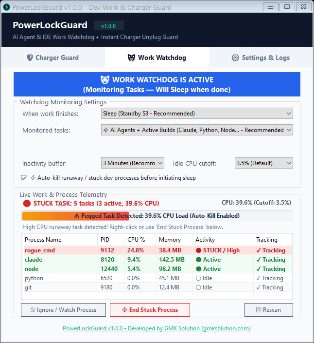
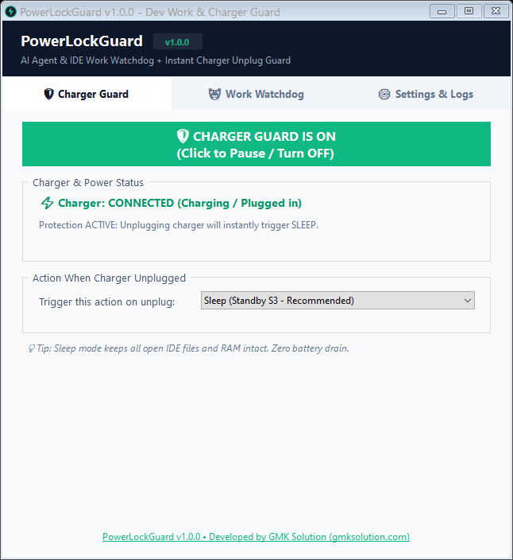
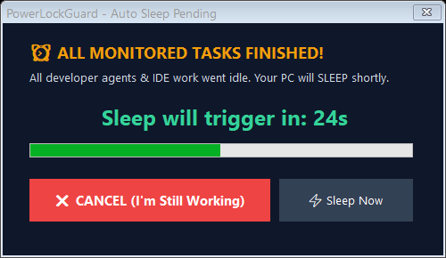
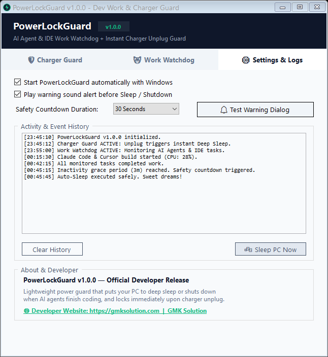
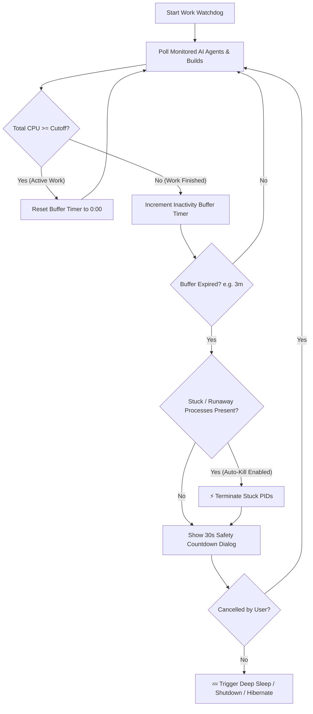

# 🛡️ PowerLockGuard v1.0.0

> **Smart Power Guard for Developers, AI Agents & Laptop Users**  
> *Auto-Sleep or Shut Down when AI Agents & IDE tasks finish — with Smart Stuck Process Auto-Kill & Instant Charger Unplug Guard.*  
> **Crafted with ❤️ by [GMK Solution](https://gmksolution.com)**

<p align="center">
  <a href="#-english"><b>English 🇬🇧</b></a> •
  <a href="#-বাংলা-ভার্সন-bengali"><b>বাংলা 🇧🇩</b></a> •
  <a href="https://github.com/GMKamrussama/PowerLockGuard/releases/latest"><b>Latest Release 📦</b></a>
</p>

<p align="center">
  <a href="https://github.com/GMKamrussama/PowerLockGuard/releases/latest"></a>
  <a href="https://apps.microsoft.com/detail/PowerLockGuard"></a>
  <a href="https://gmksolution.com"></a>
</p>

<p align="center">
  
  
  
  
  
  
</p>

---

<a name="-english"></a>
# 🇬🇧 English Documentation

## 🏢 About GMK Solution
PowerLockGuard is built by **[GMK Solution](https://gmksolution.com)** — dedicated to creating ultra-lightweight, privacy-first, and zero-telemetry desktop tools that solve real-world productivity problems for software engineers and everyday power users.
- **Official Website:** [https://gmksolution.com](https://gmksolution.com)
- **Source Repository:** [https://github.com/GMKamrussama/PowerLockGuard](https://github.com/GMKamrussama/PowerLockGuard)

---

## 💡 The Real-World Problems PowerLockGuard Solves

### 🌙 1. The Overnight AI Agent & Long-Build Nightmare
As a software engineer, you often run autonomous AI coding agents (**Claude Code, Cursor, Aider, Codex, Copilot, Cline, Antigravity**) or long-running builds (`npm build`, `cargo test`, `python train.py`, `dotnet publish`) late at night.
- **The Catch:** If you go to bed, standard Windows Sleep timers either put the PC to sleep mid-build (ruining your task) or keep the PC running hot at 100% power all night long after the job finished at 1:30 AM!
- **The Stuck Process Catch:** An orphaned background terminal or deadlocked script (`cmd.exe`, `python`, etc.) can hang on a CPU core consuming 25% CPU, preventing sleep forever.
- 👉 **PowerLockGuard Solution:** 
  1. Activates **Work Watchdog** with an intelligent **Inactivity Buffer** (e.g., 3 minutes) and **Idle CPU Cutoff** (e.g., 3.5%).
  2. Displays a **Live Per-Process Telemetry Grid** color-coding each task.
  3. **Auto-kills stuck/runaway processes** before initiating sleep so no hung background loop can keep your machine awake all night!

### ⚡ 2. Sudden Electricity Outage / Router Offline (Freeze AI Agents in RAM)
When electricity suddenly goes out, your WiFi router shuts down immediately. If an autonomous AI coding agent (**Claude Code, Cursor, Aider, Codex**) or cloud API sync is mid-execution, the sudden loss of internet causes network timeouts, broken responses, wasted LLM tokens, and corrupted project state.
- 👉 **PowerLockGuard Solution:** 
  The exact millisecond electricity fails and the AC charger goes offline, **Charger Guard** puts your laptop into **Deep Sleep (S3 Standby)**.
  - It freezes all active terminal tasks, IDE processes, and RAM state in place *before* they can crash from network disconnects.
  - When power returns and your router boots back up, simply tap the power button: your machine wakes up instantly from RAM with all open files, terminals, and agents right where they were paused without losing a single token or corrupting code!
  - *Bonus:* Also acts as a physical anti-theft and battery preservation trigger if someone unplugs your laptop at a cafe, office, or library.

---

## 📸 Visual Tour & Screenshots

| 🤖 AI Agent & Work Watchdog (Live Telemetry & Red Stuck Alert) | 🛡️ Instant Charger Unplug Guard |
|:---:|:---:|
|  |  |
| *Real-time process table, red stuck process highlight, emerald active agents & colorful gradient meter* | *Triggers Instant S3 Deep Sleep the millisecond charger cord is disconnected* |

| ⏰ 30-Second Audible Safety Countdown Dialog | ⚙️ Settings, Windows Startup & Live Event Log |
|:---:|:---:|
|  |  |
| *Clear countdown with audible chime before action. Press Esc or Cancel anytime* | *1-Click Windows Startup toggle, sound preferences, and exact audit history* |

---

## 🔄 How the Watchdog Works (Workflow)



---

## 🌟 Key Features

### ⚡ 1. Autonomous AI Agent & Build Engine
- **Pre-Configured Modes:**
  - `⚡ AI Agents + Active Builds (Recommended)`: Auto-monitors `claude`, `aider`, `codex`, `copilot`, `cline`, `python`, `node`, `git`, `cargo`, etc.
  - `🤖 AI Coding Agents Only`: Strictly focuses on autonomous agent processes.
  - `💻 All Dev Tools`: Includes heavy IDE background runtimes (`cursor`, `code`, `antigravity`, `windsurf`).
  - `🎯 Specific Process Name`: Track any custom binary or script name.
- **Configurable Idle CPU Cutoff:** Select between `1.5%`, `2.5%`, `3.5% (Default)`, `5.0%`, `8.0%`, or `10.0%`.

### 🔴 2. Stuck / Runaway Task Detection & Auto-Kill
- Automatically detects deadlocked loops or pegged orphaned processes (> 15% CPU).
- Highlights stuck processes in **vivid Alert Red (`🔴 STUCK / High`)** at the top of the table.
- **Auto-Kill on Sleep:** Enables automatic termination of stuck processes prior to executing sleep so the PC is guaranteed to rest.

### 📊 3. Live Per-Process Telemetry Grid
- Double-buffered, flicker-free list view showing:
  - **Process Name**
  - **PID**
  - **CPU %** (Calculated with multi-core normalization)
  - **RAM Memory (MB)**
  - **Activity State** (`🔴 STUCK / High`, `🟢 Active`, `⚪ Idle`)
  - **Tracking State** (`✓ Tracking`, `🚫 Ignored`)
- **100% Responsive Grid:** Automatically scales column widths with zero bottom horizontal scrollbar.
- **Manual Actions:** "🚫 Ignore / Watch Process", "⚡ End Stuck Process", and "🔄 Rescan".

### 🎨 4. Modern Colorful Activity & Countdown Meter
- Replaces standard flat progress bars with a custom-painted 22px anti-aliased gradient meter:
  - **Active Work Mode:** Vibrant Emerald-to-Teal gradient tracking CPU load.
  - **Stuck Task Mode:** Vibrant Amber-to-Red gradient warning of heavy load.
  - **Idle Countdown Mode:** Royal Blue-to-Indigo gradient tracking buffer elapsed time.

### 🛡️ 5. Instant Charger Unplug Guard
- Automatically monitors AC power status.
- Unplugging triggers instantaneous S3 Deep Sleep or Workstation Lock in milliseconds.
- Protects battery cycle health and serves as a physical anti-theft safeguard in public venues.

### 🪶 6. Ultra-Lightweight, Privacy-First Architecture
- **Size:** Single standalone binary (~90 KB).
- **Zero Dependencies:** Runs on native Windows .NET Framework (pre-installed on every Windows 10 & 11 machine).
- **100% Offline:** Absolutely zero network requests, zero analytics, zero data collection.

---

## 📊 Comparison: Why PowerLockGuard Beats Other Solutions

| Feature | Windows Default Sleep | Custom Shell Script | PowerLockGuard v1.0.0 |
|:---|:---:|:---:|:---:|
| **Understands AI Agents & Subprocesses** | ❌ No | ⚠️ Fragile grep | ✅ Automatic Multi-Process Engine |
| **Tolerates LLM API Latency (Grace Buffer)** | ❌ No | ⚠️ Hardcoded sleep | ✅ Configurable 1m–10m Buffer |
| **Detects & Highlights Stuck Processes** | ❌ No | ❌ No | ✅ Vivid Red Alert & Top Priority |
| **Auto-Kills Hung Processes Before Sleep** | ❌ No | ❌ No | ✅ Built-in Auto-Kill Engine |
| **Live Telemetry (PID, CPU, RAM)** | ❌ No | ⚠️ Terminal text | ✅ Modern GUI Grid & Color Badges |
| **Instant Charger Disconnection Trigger** | ❌ No | ❌ No | ✅ Millisecond S3 Deep Sleep |
| **Audible Safety Countdown Cancel Window** | ❌ No | ❌ No | ✅ 30s Visual Alert + Audio Chime |
| **Zero-Install Single Binary (< 100 KB)** | N/A | ❌ Needs interpreter | ✅ Single Native Windows EXE |

---

## 📥 Installation & Quick Start

### 🚀 Method 1: Portable Run (Zero Installation - Recommended)
1. Download the latest standalone **[`PowerLockGuard.exe`](https://github.com/GMKamrussama/PowerLockGuard/releases/latest/download/PowerLockGuard.exe)**.
2. Place it anywhere (e.g. `C:\Tools\PowerLockGuard\` or Desktop).
3. Double-click to launch! That's it — no installers, no registries, no admin rights required.

### 🛒 Method 2: Microsoft Store / Windows Package Manager (winget)
```powershell
# Install via winget
winget install PowerLockGuard

# Or update anytime
winget upgrade PowerLockGuard
```
*Or get it directly from the [Microsoft Store Page](https://apps.microsoft.com/detail/PowerLockGuard).*

### ⚙️ Method 3: Run on Windows Startup (1-Click)
1. Open PowerLockGuard.
2. Go to the **Settings & Logs** tab.
3. Check **`Start minimized with Windows`**.
4. PowerLockGuard will silently sit in your system tray on boot using negligible memory (~15 MB RAM, 0.0% CPU).

### 🛠️ Method 4: Compile from Source (1-Click in 2 Seconds)
No Visual Studio required! Uses the built-in Windows C# compiler:
```cmd
git clone https://github.com/GMKamrussama/PowerLockGuard.git
cd PowerLockGuard
Build.bat
```

---

<a name="-বাংলা-ভার্সন-bengali"></a>
# 🇧🇩 বাংলা ভার্সন (Bengali Documentation)

## 🏢 ডেভেলপার পরিচিতি
**PowerLockGuard v1.0.0** তৈরি করেছে **[GMK Solution](https://gmksolution.com)**। এটি ডেভেলপারদের কাজের সুবিধার্থে তৈরি একটি সম্পূর্ণ অফলাইন, প্রাইভেসি-ফার্স্ট এবং সুপার-লাইটওয়েট পাওয়ার গার্ড ইউটিলিটি।  
- **অফিশিয়াল ওয়েবসাইট:** [https://gmksolution.com](https://gmksolution.com)
- **গিটহাব সোর্স:** [https://github.com/GMKamrussama/PowerLockGuard](https://github.com/GMKamrussama/PowerLockGuard)

---

## 🌟 পাওয়ারলক গার্ড যে দুটি বড় সমস্যার সমাধান করে:

### 🌙 ১. রাতে এআই এজেন্ট বা কোড বিল্ড রান করে নিশ্চিন্তে ঘুমান:
রাত ১২টায় আপনি ঘুমাতে যেতে চান, কিন্তু ব্যাকগ্রাউন্ডে কোডিং এআই এজেন্ট (**Claude Code, Cursor, Aider, Codex, Copilot, Cline**) কিংবা ভারী কোনো কোড কম্পাইল বা টেস্ট রান হচ্ছে। 
- **ঝামেলা:** উইন্ডোজের সাধারণ স্লিপ টাইমার কাজ চলাকালীন হঠাৎ পিসি স্লিপ করে কাজ নষ্ট করে দেয়, অথবা কাজ শেষ হয়ে গেলেও সারা রাত পিসি চালু রেখে অতিরিক্ত বিদ্যুৎ ও ব্যাটারি অপচয় করে। আর কোনো প্রসেস যদি আটকে (Stuck) থাকে, তবে পিসি কখনোই স্লিপ হয় না।
- 👉 **পাওয়ারলক গার্ডের সমাধান:**
  1. **Work Watchdog** ট্যাবে যান এবং অ্যাকশন হিসেবে নির্বাচন করুন **`Sleep (Standby S3 - Recommended)`**।
  2. **`⚡ Auto-kill runaway / stuck dev processes before initiating sleep`** অপশনটি অন রাখুন।
  3. **ACTIVATE WORK WATCHDOG** অন করে ঘুমিয়ে পড়ুন!
  4. এআই এজেন্টের কাজ শেষ হওয়া মাত্রই সফটওয়্যারটি বাফার টাইম গণনা শুরু করবে। কোনো আটকে থাকা প্রসেস থাকলে তা স্বয়ংক্রিয়ভাবে কিল করে ৩০ সেকেন্ডের সেফটি কাউন্টডাউন দিয়ে পিসি স্লিপে পাঠিয়ে দেবে।

### ⚡ ২. হঠাৎ বিদ্যুৎ চলে যাওয়া / রাউটার অফ হলে এআই টাস্ককে RAM-এ ফ্রিজ করে রাখা:
হঠাৎ করে বিদ্যুৎ চলে গেলে সাথে সাথে ওয়াইফাই রাউটার অফ হয়ে যায়। এই সময় আপনার এআই কোডিং এজেন্ট (Claude Code, Cursor, Aider ইত্যাদি) যদি কোড লিখা বা API রিকোয়েস্টের মাঝপথে থাকে, নেটওয়ার্ক বিচ্ছিন্ন হওয়ায় এরর আসে, রেসপন্স নষ্ট হয়, দামি LLM টোকেন অপচয় হয় এবং প্রজেক্টের কোড এররে আটকে যায়!
- 👉 **পাওয়ারলক গার্ডের সমাধান:**
  বিদ্যুৎ চলে যাওয়ার সাথে সাথে ল্যাপটপের চার্জার অফলাইন হয়ে যায়। চার্জার গার্ড চোখের পলকে আপনার পুরো পিসিকে **Deep Sleep (S3 Standby)**-এ পাঠিয়ে দেয়!
  - আপনার সমস্ত টার্মিনাল, IDE প্রসেস এবং চলমান কাজ অক্ষত অবস্থায় RAM-এ সাময়িকভাবে পজ/ফ্রিজ হয়ে থাকে।
  - বিদ্যুৎ আসার পর রাউটার অন হলে ল্যাপটপের পাওয়ার বাটন চাপলেই সব কাজ ঠিক যেখান থেকে পজ হয়েছিল, সেখান থেকেই নির্ভুলভাবে চালু হয়ে যাবে—কোনো কাজ বা টোকেন নষ্ট হবে না!
  - *অতিরিক্ত সুবিধা:* অফিস বা ক্যাফেতে কাজ করার সময় কেউ ল্যাপটপের চার্জার খুললে অ্যান্টি-থেফট প্রটেকশন হিসেবেও ইনস্ট্যান্ট লক/স্লিপ নিশ্চিত করে।

---

## 📸 সফটওয়্যারের স্ক্রিনশটসমূহ

| 🤖 এআই এজেন্ট ও লাইভ প্রসেস টেলিমেট্রি | 🛡️ চার্জার আনপ্লাগ ডিপ স্লিপ গার্ড |
|:---:|:---:|
|  |  |
| *আটকে থাকা প্রসেস লাল রঙে হাইলাইট, সক্রিয় কাজ সবুজ রঙে এবং রেসপনসিভ টেবিল* | *চার্জার প্লাগ আউট হওয়ার সাথে সাথে মিলিসেকেন্ডে ডিপ স্লিপ* |

| ⏰ ৩০ সেকেন্ড অডিও সেফটি কাউন্টডাউন | ⚙️ সেটিংস ও অ্যাক্টিভিটি ইভেন্ট লগ |
|:---:|:---:|
|  |  |
| *স্লিপের আগে অ্যালার্ট ও বিপ। বাতিল করতে Esc চাপুন* | *উইন্ডোজ অটো-স্টার্ট অপশন এবং প্রতি সেকেন্ডের নির্ভুল লগ* |

---

## ✨ প্রধান সুবিধাসমূহ:
1. **🤖 স্মার্ট এআই ওয়াচডগ:** ক্লড কোড, কার্সর, পাইথন, নোড, গিট ইত্যাদি প্রসেস অটোমেটিক ট্র্যাকিং।
2. **🔴 আটকে থাকা প্রসেস অটো-কিল:** কোনো ব্যাকগ্রাউন্ড টার্মিনাল যদি হ্যাং হয়ে থাকে, স্লিপে যাওয়ার আগে সফটওয়্যার নিজেই সেটিকে ক্লোজ করে স্লিপ নিশ্চিত করে।
3. **📊 লাইভ প্রসেস টেবিল:** প্রতিটি প্রসেসের PID, CPU %, RAM এবং স্ট্যাটাস স্পষ্ট ব্যাজে দেখা যায়। কোনো হরাইজন্টাল স্ক্রলবার নেই।
4. **🎨 ডায়নামিক কালারফুল প্রগ্রেস বার:** কাজ চলার সময় CPU লোড এবং আইডল থাকলে স্লিপ কাউন্টডাউন গ্রেডিয়েন্ট বারে প্রদর্শিত হয়।
5. **🪶 ১০০% অফলাইন ও লাইটওয়েট:** মাত্র ৯০ কেবি সাইজ, কোনো ইনস্টলার ছাড়াই সরাসরি ডাবল ক্লিকে চালু হয়।

---

## 📥 ডাউনলোড ও ইন্সটলেশন

- 🚀 **[সরাসরি ডাউনলোড করুন: PowerLockGuard.exe](https://github.com/GMKamrussama/PowerLockGuard/releases/latest/download/PowerLockGuard.exe)**
- 🛒 **[মাইক্রোসফট স্টোর থেকে ইনস্টল করুন](https://apps.microsoft.com/detail/PowerLockGuard)**
- 💻 **উইন্ডোজ টার্মিনালে কমান্ড:**
  ```powershell
  winget install PowerLockGuard
  ```

---

## 📄 লাইসেন্স (License)
সম্পূর্ণ **MIT License**-এর অধীনে উন্মুক্ত করা হয়েছে। যেকোনো ডেভেলপার এটি বিনামূল্যে ব্যবহার ও পরিবর্তন করতে পারবেন।  
**Developer:** [GMK Solution](https://gmksolution.com)
