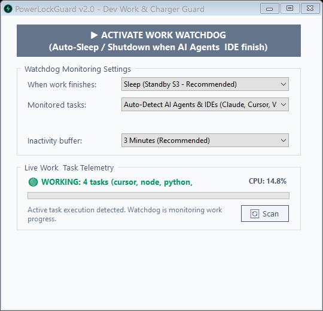
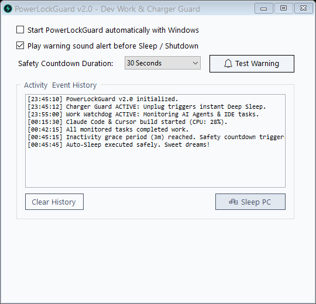

# 🛡️ PowerLockGuard v2.0

> **Smart Power Guard for Developers, AI Agents & Laptop Users**  
> *Auto-Sleep or Shut Down when AI Agents & IDE tasks finish — and Instant Deep Sleep on Charger Unplug.*

<p align="center">
  <a href="#-english"><b>English 🇬🇧</b></a> •
  <a href="#-বাংলা-ভার্সন-bengali"><b>বাংলা 🇧🇩</b></a>
</p>

<p align="center">
  <a href="https://github.com/YOUR_USERNAME/PowerLockGuard/releases/latest"></a>
  <a href="StorePackaging/MICROSOFT_STORE_GUIDE.md"></a>
</p>

<p align="center">
  
  
  
  
</p>

---

## 📥 Download & Installation

### Option 1: Direct Executable Download (GitHub Release)
No installer required. Download the single lightweight standalone `.exe` (~62 KB) and run it:
- 🚀 **[Download Latest PowerLockGuard.exe](https://github.com/YOUR_USERNAME/PowerLockGuard/releases/latest/download/PowerLockGuard.exe)**
- Or download via **GitHub CLI**:
  ```bash
  gh release download --repo YOUR_USERNAME/PowerLockGuard --pattern "PowerLockGuard.exe"
  ```

### Option 2: Microsoft Store / Windows Package Manager (winget)
You can install and keep PowerLockGuard updated via the Microsoft Store or command line:
- 🛒 **[Get it from Microsoft Store](https://apps.microsoft.com/detail/PowerLockGuard)**
- Or install via **winget**:
  ```powershell
  winget install PowerLockGuard
  ```

---

<a name="-english"></a>
# 🇬🇧 English Documentation

## 🌟 The Problems We Solve

### 🌙 Scenario 1: Leaving AI Agents & Builds Running Overnight
You are working late at night (e.g. 12:00 AM). Several AI coding agents (**Claude Code, Cursor, Aider, Codex, Copilot**) or long-running builds, test suites, or training scripts are active on your PC. You need to sleep, but you don't want your laptop running hot at full power all night long after the tasks finish.

👉 **The Solution:**  
1. Switch to the **Work Watchdog** tab.
2. Select your action: **Sleep (Standby S3 - Recommended)** or **Shut Down**.
3. Click **ACTIVATE WORK WATCHDOG** and go to bed!
4. PowerLockGuard monitors the tasks and child processes. When work completes and stays idle for the configured grace period, your PC automatically sleeps or powers down.

### ⚡ Scenario 2: Instant Sleep on Charger Disconnection
You want your laptop to lock down or sleep instantly the moment someone disconnects the charger cord (e.g., leaving a workspace, battery preservation, or anti-tamper).

👉 **The Solution:**  
1. Turn on **Charger Guard**.
2. Whenever the power cord is unplugged, your laptop enters **Deep Sleep (S3 Standby)** within milliseconds. Zero battery drain, and all open IDE tabs remain intact in RAM upon manual wake-up.

---

## 📸 Screenshots

| 🤖 AI Agent & Work Watchdog | 🛡️ Instant Charger Unplug Guard |
|:---:|:---:|
|  |  |
| *Auto-sleeps when AI agents & IDE tasks finish* | *Instant deep sleep on power cord disconnection* |

| ⏰ Safety Countdown Warning Dialog | ⚙️ Settings & Activity History |
|:---:|:---:|
|  |  |
| *30s audio chime & warning. Press Esc to cancel* | *Auto-start with Windows & full activity logs* |

---

## ✨ Key Features

- **🤖 Smart AI Agent & IDE Watchdog:**
  - **Auto-Detection Preset:** Automatically tracks popular AI coding tools and runtimes:
    - *Agents & CLIs:* `Claude Code`, `Aider`, `Codex`, `Copilot CLI`, `Gemini`, `Antigravity`, `Cline`
    - *IDEs & Editors:* `Cursor`, `VS Code`, `Windsurf`, `Visual Studio`, `JetBrains` (PyCharm, WebStorm, IntelliJ)
    - *Compilers & Tools:* `Node.js`, `Python`, `Git`, `Cargo` / `Rust`, `dotnet`, `Java`, `npm`, `yarn`
  - **Specific Process Mode:** Target a specific executable or script (e.g. `claude`, `python train.py`, `npm test`).
- **⏱️ Smart Inactivity Buffer (Grace Period):**
  - Configurable: **1, 2, 3 (Recommended), 5, or 10 minutes** of sustained idle time.
  - Prevents premature sleep while an agent is waiting for an LLM API reply (which often takes 15–45 seconds).
- **🔔 Safety Countdown Warning Dialog:**
  - When tasks finish, a prominent 30/60-second warning dialog appears with an audio chime.
  - If you are still at your desk, tap **Cancel** or press `Esc` to keep your PC awake.
- **⚡ Multiple Power Actions:**
  - **Sleep (Standby S3)** *(Recommended)*: Preserves RAM, instantaneous wake-up, keeps code and files intact.
  - **Shut Down**: Complete power-off.
  - **Hibernate**: Saves memory to SSD/HDD and turns off.
  - **Lock Screen**: Locks Windows desktop.
- **🪶 Ultra-Lightweight & Offline:**
  - Standalone executable (~62 KB).
  - 100% offline, zero network telemetry, <0.1% background CPU.
  - Native Windows system tray integration.

---

## 🛠️ Build & Development

### 1-Click Instant Build
Double-click:
```cmd
Build.bat
```
Uses the built-in Windows C# compiler (`csc.exe`) to compile `PowerLockGuard.exe` with embedded multi-resolution icon in under 2 seconds.

### Visual Studio / MSBuild
```cmd
msbuild PowerLockGuard.csproj /p:Configuration=Release
```

---

<a name="-বাংলা-ভার্সন-bengali"></a>
# 🇧🇩 বাংলা ভার্সন (Bengali Documentation)

## 🌟 যে দুটি সমস্যার স্থায়ী সমাধান:

### 🌙 ১. রাতে এআই এজেন্ট বা কোড রান করে নিশ্চিন্তে ঘুমান:
রাত ১২টায় আপনি ঘুমাতে যেতে চান, কিন্তু ব্যাকগ্রাউন্ডে কোডিং এআই এজেন্ট (**Claude Code, Cursor, Aider, Codex, Copilot**) অথবা কোনো স্ক্রিপ্ট বা বিল্ড রান হচ্ছে। আপনি ঘুমাতে পারছেন না কারণ কাজ শেষ হলে পিসি সারা রাত অন থাকবে।

👉 **পাওয়ারলক গার্ডের সমাধান:**
1. **Work Watchdog** ট্যাবে যান।
2. আপনার পছন্দের অ্যাকশন নির্বাচন করুন: 💤 **Sleep (Standby S3 - Recommended)** অথবা 🛑 **Shut Down PC**।
3. **ACTIVATE WORK WATCHDOG** বাটনে ক্লিক করে ঘুমাতে যান!
4. এআই এজেন্ট ও কোডিং টাস্ক শেষ হয়ে টানা ৩ মিনিট (বা আপনার সেট করা বাফার সময়) নিষ্ক্রিয় থাকলে সফটওয়্যারটি স্বয়ংক্রিয়ভাবে পিসি স্লিপ বা শাটডাউন করে দেবে।

### ⚡ ২. চার্জার খুললেই ইনস্ট্যান্ট স্লিপ (Charger Guard):
ল্যাপটপ থেকে চার্জার খোলার সাথে সাথে চোখের পলকে পিসি **Deep Sleep (S3 Standby)** মোডে চলে যাবে। ডিসপ্লে ও ফ্যানের পাওয়ার সম্পূর্ণ বন্ধ হয়ে যাবে, কোনো ব্যাটারি খরচ হবে না এবং পাওয়ার বাটন চাপলেই সব কোড ও ফাইল আগের মতোই খোলা পাবেন। স্বাভাবিক কাজের সময় ১-ক্লিকেই প্রোটেকশন **PAUSED** করে রাখা যায়।

---

## 📥 ডাউনলোড ও ব্যবহার করার নিয়ম

### গিটহ্যাব থেকে সরাসরি ডাউনলোড (.exe):
কোনো ইন্সটলারের প্রয়োজন নেই! সরাসরি সিঙ্গেল এক্সিকিউটেবল ডাউনলোড করে ডাবল-ক্লিক করলেই চালু হবে:
- 🚀 **[সরাসরি ডাউনলোড করুন: PowerLockGuard.exe (~62 KB)](https://github.com/YOUR_USERNAME/PowerLockGuard/releases/latest/download/PowerLockGuard.exe)**

### মাইক্রোসফট স্টোর বা টার্মিনাল থেকে ইনস্টল:
- 🛒 **[মাইক্রোসফট স্টোর থেকে ইনস্টল করুন](https://apps.microsoft.com/detail/PowerLockGuard)**
- অথবা **PowerShell / Terminal**-এ নিচের কমান্ডটি দিন:
  ```powershell
  winget install PowerLockGuard
  ```

---

## 📸 সফটওয়্যারের স্ক্রিনশটসমূহ:

| 🤖 এআই এজেন্ট ও আইডিই ওয়াচডগ | 🛡️ ইনস্ট্যান্ট চার্জার আনপ্লাগ গার্ড |
|:---:|:---:|
|  |  |
| *কোডিং এজেন্ট ও বিল্ড শেষ হলে অটো স্লিপ* | *চার্জার খুললেই তাৎক্ষণিক ডিপ স্লিপ* |

| ⏰ সেফটি কাউন্টডাউন ও বিপ অ্যালার্ট | ⚙️ সেটিংস ও অ্যাক্টিভিটি হিস্ট্রি |
|:---:|:---:|
|  |  |
| *স্লিপের আগে ৩০ সেকেন্ড সতর্কবার্তা ও বিপ* | *উইন্ডোজের সাথে অটো-স্টার্ট ও ইভেন্ট লগ* |

---

## 🛒 মাইক্রোসফট স্টোরে পাবলিশ করার গাইড

মাইক্রোসফট পার্টনার সেন্টারে অ্যাপটি সহজে পাবলিশ করার জন্য বিস্তারিত গাইড ও মেনিফেস্ট প্রস্তুত আছে:
- 📄 নির্দেশিকা: [`StorePackaging/MICROSOFT_STORE_GUIDE.md`](StorePackaging/MICROSOFT_STORE_GUIDE.md)
- 🖼️ মাইক্রোসফট স্টোর ১৯২০x১০৮০ শোকেস প্রমোশনাল ইমেজ: [`StorePackaging/assets/`](StorePackaging/assets/)
- 📦 MSIX Manifest: [`StorePackaging/Package.appxmanifest`](StorePackaging/Package.appxmanifest)

---

## 📄 লাইসেন্স (License)

সম্পূর্ণ **MIT License**-এর অধীনে ওপেন-সোর্স করা হয়েছে। বিশ্বের যেকোনো ডেভেলপার এটি বিনামূল্যে ব্যবহার, মডিফাই ও রি-ডিস্ট্রিবিউট করতে পারবেন। বিস্তারিত জানতে [`LICENSE`](LICENSE) ফাইলটি দেখুন।
